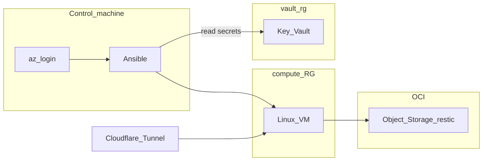

# homelab-ops

Terraform, Ansible, and Docker Compose for a production-style **Azure** homelab: VM and networking as code, **Azure Key Vault** for secrets (`vault-rg`), **Cloudflare Tunnel** and **Tailscale** for access, **OCI Object Storage** with **restic** for backups, and a full observability stack (Prometheus, Grafana, Loki).

## Technical scope

| Area | What the repository shows |
|------|-----------------------------|
| **Infrastructure as code** | Terraform (`azurerm`): resource group, VNet, subnet, NSG, public IP, NIC, Linux VM (including disk sizing and Spot-friendly configuration). |
| **Configuration management** | Ansible roles for Key Vault–backed facts, Linux hardening, Docker or Podman, data directories, ordered Compose deploy, backup cron, optional restore, tunnel agent, Tailscale. |
| **Containers** | Multi-service **Docker Compose** stacks with pinned images, health checks, bind mounts, and documented host paths. |
| **Security** | No secrets in Git; Key Vault integration; baseline hardening; ingress via tunnel rather than wide exposure of app ports. |
| **Backup & recovery** | restic to S3-compatible object storage, database dumps, scripted restore with ownership fixes for bind-mounted data. |
| **Observability** | Prometheus, Grafana, Loki, and Promtail definitions under `docker/stacks/monitoring`. |
| **Quality gates** | GitHub Actions: `terraform fmt -check`, `terraform validate`, and `ansible-playbook --syntax-check` on every push to `main`. |

For step-by-step operations, see **[docs/README.md](docs/README.md)**. Repository layout and data flow: **[docs/ARCHITECTURE.md](docs/ARCHITECTURE.md)**.

## Quick links

| Document | Purpose |
|----------|---------|
| [docs/README.md](docs/README.md) | Operator runbook (Terraform → Key Vault → Ansible → backups) |
| [docs/ARCHITECTURE.md](docs/ARCHITECTURE.md) | Directory layout and controller vs VM responsibilities |
| [terraform/README-tf.md](terraform/README-tf.md) | Variables and `terraform apply` |
| [docker/DEPLOYMENT.md](docker/DEPLOYMENT.md) | Playbook role order, tunnel port map, migration notes |
| [docker/BACKUP_STRATEGY.md](docker/BACKUP_STRATEGY.md) | restic layout and retention |
| [ansible/README-ansible.md](ansible/README-ansible.md) | Inventory setup, tags, Podman vs Docker |
| [CONTRIBUTING.md](CONTRIBUTING.md) | Conventions and local checks |
| [SECURITY.md](SECURITY.md) | Secret handling and reporting |

## Stack summary

| Layer | Technology |
|--------|------------|
| Provisioning | Terraform (`azurerm`) |
| Secrets | Azure Key Vault in **`vault-rg`** (recommended, separate from compute RG) |
| Configuration | Ansible (`keyvault_secrets` uses `az keyvault` on the controller) |
| Workloads | Docker Compose under `docker/stacks/` |
| Access | Cloudflare Tunnel, Tailscale |
| Backups | OCI S3-compatible API + restic |

## Secret management

- Do **not** commit `terraform.tfvars`, `docker/.env`, `secrets.yml`, or `ansible/vars/secrets.yml`. Use [docker/.env.example](docker/.env.example) and [ansible/vars/secrets.yml.example](ansible/vars/secrets.yml.example) as templates.
- Copy [ansible/inventory/hosts.ini.example](ansible/inventory/hosts.ini.example) to `ansible/inventory/hosts.ini` (gitignored) before running playbooks; never commit real hostnames or IPs if the repository is public.
- Key Vault secret names map from `vault_*` Ansible facts; see [ansible/roles/keyvault_secrets/defaults/main.yml](ansible/roles/keyvault_secrets/defaults/main.yml).

## Maintenance

- Pin image tags in Compose; take a backup before major version jumps.
- After each Ansible deploy, validate application health and tunnel routes before relying on production traffic.
