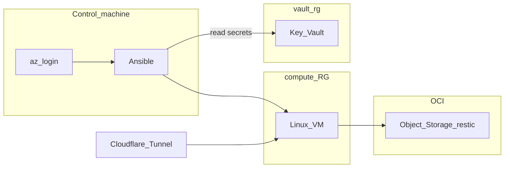

# homelab-ops

Terraform + Ansible + Docker Compose for a personal homelab on **Azure**: VM, networking, **Azure Key Vault** secrets (`vault-rg`), **Cloudflare Tunnel** / **Tailscale**, **OCI Object Storage** backups with **restic**, and observability stacks.

## Quick links

| Doc | Purpose |
|-----|---------|
| **[docs/README.md](docs/README.md)** | **Start here** — full operations runbook (Terraform → Key Vault → Ansible → backups) |
| [docs/ARCHITECTURE.md](docs/ARCHITECTURE.md) | Repo layout and where workloads run |
| [terraform/README-tf.md](terraform/README-tf.md) | Azure VM variables and `apply` |
| [docker/DEPLOYMENT.md](docker/DEPLOYMENT.md) | Playbook behavior, tunnel port map, migration notes |
| [docker/BACKUP_STRATEGY.md](docker/BACKUP_STRATEGY.md) | restic layout and retention |
| [ansible/README-ansible.md](ansible/README-ansible.md) | Inventory, tags, Podman vs Docker |
| [SECURITY.md](SECURITY.md) | Secrets policy and reporting |

## Stack (summary)

| Layer | Technology |
|--------|------------|
| Provisioning | Terraform (`azurerm`) |
| Secrets | Key Vault in **`vault-rg`** (recommended, separate from compute RG) |
| Config | Ansible (`keyvault_secrets` uses `az keyvault` on the controller) |
| Workloads | Docker Compose under `docker/stacks/` |
| Access | Cloudflare Tunnel, Tailscale |
| Backups | OCI S3-compatible API + restic |

## Secret management (rules)

- Do **not** commit `terraform.tfvars`, `docker/.env`, `secrets.yml`, or `ansible/vars/secrets.yml`. Use [docker/.env.example](docker/.env.example) and [ansible/vars/secrets.yml.example](ansible/vars/secrets.yml.example) as templates.
- Key Vault secret names map from `vault_*` Ansible facts; see [ansible/roles/keyvault_secrets/defaults/main.yml](ansible/roles/keyvault_secrets/defaults/main.yml).

## Maintenance

- Pin image tags in Compose; take a backup before major upgrades.
- Validate apps locally (or via tunnel) after each Ansible deploy.
