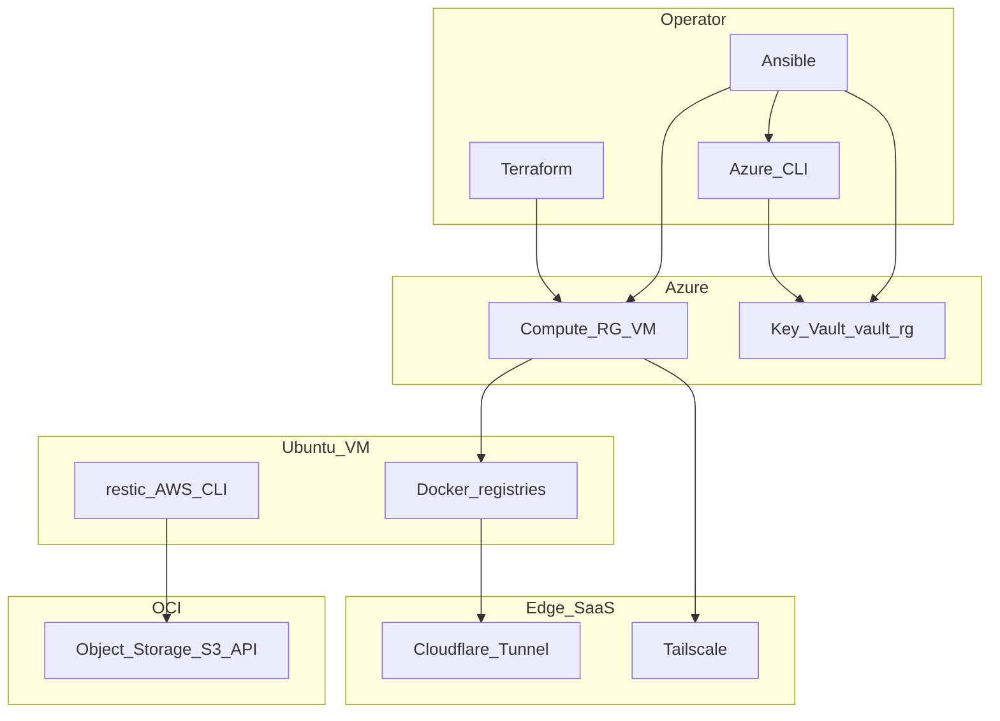

# External dependencies

This page lists **outside services, networks, and tooling** the repository and a running homelab depend on. Use it for onboarding, firewall allow lists, and outage triage.

## 1. Cloud platforms and accounts

| Dependency | Where it is used | Notes |
|------------|------------------|--------|
| **Microsoft Azure** (subscription) | Terraform `azurerm` provider | Creates VM, VNet, NSG, public IP, NIC, resource group. Requires credentials for `terraform plan` / `apply` (`az login`, service principal, or OIDC in CI). |
| **Azure Key Vault** (recommended: resource group **`vault-rg`**) | Ansible `keyvault_secrets` | Secrets read at deploy time via **`az keyvault secret show`** on the **control machine** (`delegate_to: localhost`). Requires `az login` and RBAC on the vault (Get/List on secrets; Set when seeding). |
| **Oracle Cloud Infrastructure (OCI)** | `restic` backups on the VM | S3-compatible **Object Storage** + API keys in Key Vault (`vault_oci_s3_*`, `AWS_*` for the AWS CLI–compatible client). VM must reach your OCI region endpoint from outbound HTTPS. |

Terraform in this repo **does not** create Key Vault; manage the vault separately (Portal, CLI, or your own IaC). See [README.md](README.md) and [docs/README.md](README.md).

## 2. Control machine (laptop or CI)

| Dependency | Purpose |
|------------|---------|
| **Azure CLI** (`az`) | `az login`, Key Vault secret reads for Ansible, optional vault administration. |
| **Terraform** ≥ 1.2 | Provisions Azure compute and network. |
| **Ansible** ≥ 2.14 | `ansible-playbook`, roles, collections. |
| **`ansible-galaxy collection install -r ansible/requirements.yml`** | Installs **`community.general`** (UFW, etc.) and **`azure.azcollection`** (optional Azure modules; Key Vault reads use `az` only). |
| **SSH client** + key to the VM | Ansible connects to `azure_vm` inventory; agent forwarding is enabled in `ansible.cfg` for **git** clone of `docker_stacks_repo_url` on the VM. |
| **Git** | Clone this repo locally; the VM clones the same repo URL from `homelab_public.yml`. |

GitHub Actions CI only runs **static** checks (`terraform validate`, `ansible-playbook --syntax-check`); it does **not** need `az login` or a live vault. See [CONTRIBUTING.md](../CONTRIBUTING.md).

## 3. Azure VM (Ubuntu Server)

| Dependency | Purpose |
|------------|---------|
| **Ubuntu package mirrors** (`apt`) | Base system, Docker CE, Tailscale, security updates, `cloudflared` `.deb` install. |
| **Docker CE** (`download.docker.com`) | `base_docker` adds Docker’s apt repo and installs Engine + Compose plugin. |
| **GitHub** `releases` | `cloudflared` `.deb` downloaded from `https://github.com/cloudflare/cloudflared/releases/`. |
| **Tailscale package repo** (`pkgs.tailscale.com`) | `tailscale` role adds apt repo and installs `tailscaled`. |
| **AWS CLI v2 bundle** (`awscli.amazonaws.com`) | Installed on the VM by `base_docker` for S3-compatible OCI backups (not Azure’s Python SDK). |
| **Container registries** | Compose pulls images from **`docker.io`**, **`ghcr.io`**, and (for `torrent-client`) a **local** image build. Outbound HTTPS to registries must be allowed. |
| **DNS + outbound HTTPS** | Image pulls, `apt`, `get_url`, Tailscale control plane, Cloudflare tunnel, OCI S3 API, optional Grafana.com dashboard downloads. |

The VM does **not** need inbound app ports on the public Internet if you use **Cloudflare Tunnel** and/or **Tailscale**; NSG typically allows SSH from a restricted CIDR.

## 4. SaaS and edge

| Dependency | Purpose |
|------------|---------|
| **Cloudflare Zero Trust** | Tunnel token in Key Vault; public hostnames route to `localhost` ports on the VM. Managed in the Cloudflare dashboard. |
| **Tailscale** | Mesh VPN; auth key in Key Vault. Coordination server is Tailscale’s cloud (see [Tailscale docs](https://tailscale.com/kb/)). |

## 5. Secrets and config you supply (not in git)

| Item | Typical location |
|------|------------------|
| `terraform.tfvars` | Terraform variables; **never commit**. |
| `ansible/inventory/hosts.ini` | VM IP / `ansible_user`. **Gitignored** in this template. |
| Key Vault secrets | Names in `ansible/roles/keyvault_secrets/defaults/main.yml`. |
| `docker/.env` (optional on controller) | Local Compose experiments; Ansible renders production `.env` on the VM. |

## 6. Optional / maintenance

| Dependency | When |
|------------|------|
| **grafana.com API** | Only if you run `docker/stacks/monitoring/download-dashboards.sh` to refresh committed dashboard JSON. |
| **Git remote** | `homelab_public.yml` → `docker_stacks_repo_url` (SSH or HTTPS). |

## 7. Minimal dependency graph

For **data flow** and **directory layout**, see [ARCHITECTURE.md](ARCHITECTURE.md). For **runbook steps**, see [README.md](README.md).
